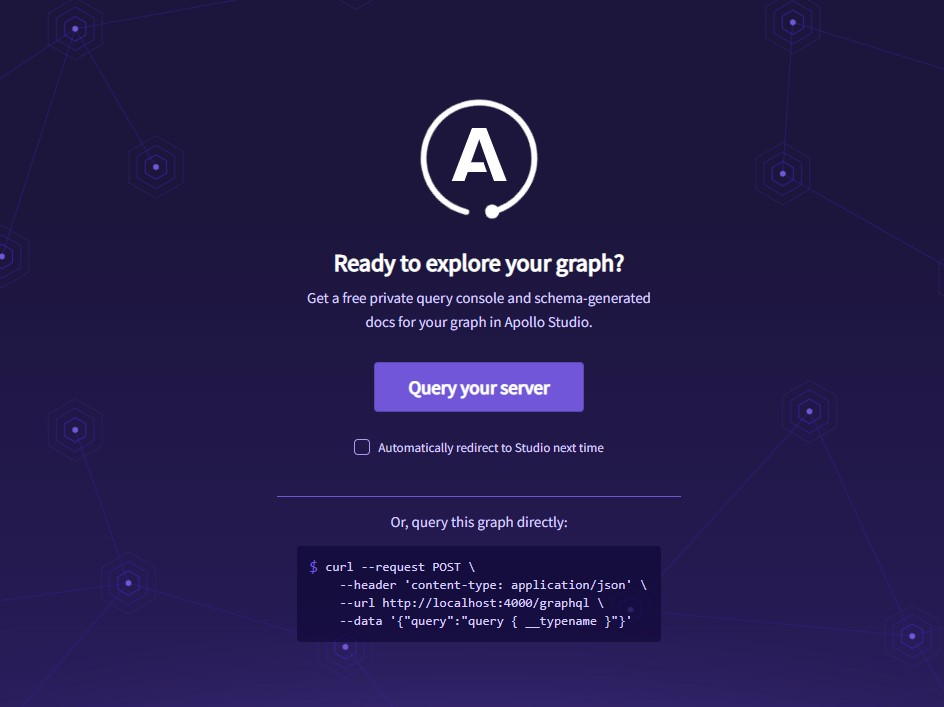

fxhash API
==========

This repository holds the fxhash public API. The `main` branch is the branch deployed on the servers.


# Stack

* Typescript/NodeJS
* [GraphQL](https://graphql.org/): this API follows the GraphQL specifications
* Postgresql: the database engine
* redis: caches the common requests
* [TypeORM](https://typeorm.io/): ORM used to handle connections and queries to the psql database, using annotations to define schema
* [TypeGraphQL](https://typegraphql.com/): annotation based tool to define graphql schema, entry points, works well in combination with TypeORM
* [DataLoader](https://github.com/graphql/dataloader): used to solved the N+1 problem introduced by GraphQL


# Architecture overview

This API is not responsible for indexing the blockchain data, but is responsible for serving the data indexed into the postgres database. It was designed to work in a parallel architecture, where many instances of the program work in parallel for handling the requests. The servers are automatically scaling the number of instances of this program as the number of requests increases, and so you can consider those instances to be stateless (they should only be used to serve the data from the database).


# Development environment

## Overview

The development environment was configured to be run with docker. Because the API doesn't index the data, some up-to-date indexed data must be seeded.

The setup works as following:

* you run docker compose
* docker sets up the environment for your
* docker will pull a snapshot of the database stored on S3 and populate your local database so that you can work on real data (takes a few minutes)
* docker starts the local server and you can access it from your host

The api hits postgres from the container network, but it is on the local network at port `5444` to avoid collisions.

redis is not exposed on a local port, you can exec into the docker container and use the `redis-cli` comand to inspect the cache.


## Setting up the environment

Move current directory to the root of the cloned/forked (fork if you want to contribute, see last section) repo.

Run docker compose to setup the environment

```shell
$ docker-compose up -d
```

Output logs to see when the db was downloaded and installed on your environment.

```shell
$ docker-compose logs -f
```

You should wait until the following message show up:


At this point, the server is ready and is exposed to the port `4000` of your host environment. By navigating to [http://localhost:4000/graphql](http://localhost:4000/graphql), you should see the following page:



You can start working on the API, changes made to a file will automatically be reflected by the API.


### Run with log tail

```shell
$ docker-compose up
```

If you exit this terminal the servers will shut down.

### Rebuild db
```shell
docker-compose down
docker-compose up -d
```


### Use your local API with the front end in your local environment

You might need to have the front-end to display the API data back, or to see if the features you implemented work properly. There will also maybe some cases for which you will need to implement features on both the front and the back.

You can link the front to your local environement very easily by changing the `NEXT_PUBLIC_API_ROOT` environment variable in the `.env` **of the front end project**.

```shell
NEXT_PUBLIC_API_ROOT = http://localhost:4000/graphql
```

It's enough to connect the 2 components.


# How to contribute

The list of features waiting for implementation can be found on the issues of this project. You can also implement features you would like to see in the API.

The workflow is the following:

* fork the project
* clone the fork on your machine
* move to the `dev` branch of the repo
* create a new branch from the `dev` branch
* make your changes
* make a pull request with the branch that holds your changes

We follow a simple nomenclature for the branches:

* `feature/_`: adding a new feature
* `change/_`: updating a feature
* `fix/_`: fix a bug